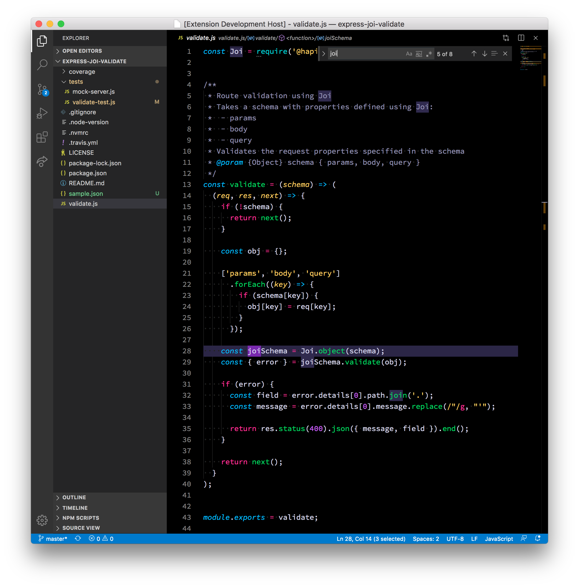
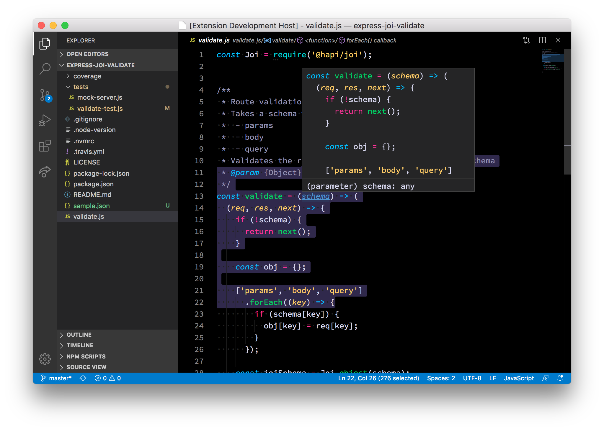

# Tinacious Design syntax

**Tinacious Design Syntax** is a syntax theme that uses a bright palette of colours including pink, blue, turquoise, green, purple, and orange.

This theme pack includes 4 themes, 2 dark and 2 light.

## 🔆 What's new?

### April 2020

- **Added 3 new themes**  🌈 Feature details and screenshots below. Don't worry, the old themes you know and love are still included, you'll just have to switch back to them. To see the screenshots of the old themes, see [this older readme](https://github.com/tinacious/vscode-tinacious-design-syntax/tree/3758ccde534b40f80e869100bdfdcd657ec2f5a0). The new themes are an enhancement on the old one and include a UI theme and better support for JSON and Markdown.

## Usage

Install it from the [Visual Studio Code](https://marketplace.visualstudio.com/items?itemName=tinaciousdesign.theme-tinaciousdesign) marketplace today.

Colours curated by Web and Mobile designer and developer Tina from [Tinacious Design](http://tinaciousdesign.com). You can read more about the theme [here](https://tinaciousdesign.com/portfolio/visual-studio-code-theme/).

## Features

- Dark themes! 🌚
- Light themes! 🌝
- 5 themes! 2 new ones, 2 original ones, and 1 **WCAG 2.0 AA compliant** high-contrast mod of the original dark
- JSON support (36 levels of love 🌈)
- Markdown support
- Git diff support
- Sidebar styles
- Status bar styles

The screenshots below are of the new theme. For legacy theme styles, see [this historical readme](https://github.com/tinacious/vscode-tinacious-design-syntax/tree/3758ccde534b40f80e869100bdfdcd657ec2f5a0).

## Dark

### JSON

### JavaScript

### Markdown

### Ruby

### Git

## Light

### JSON

### JavaScript

### Markdown

### Ruby

### Git

## High-Contrast (Dark) – WCAG 2.0 AA compliant

The theme colours offered in the high-contrast theme have been run through [the Web Accessibility in Mind Contrast Checker tool](https://webaim.org/resources/contrastchecker/) to verify colour contrast requirements for small text as per the WCAG 2.0 AA accessibility guidelines.

This theme is built off of the legacy dark theme and therefore does not offer the additional JSON and Markdown support.

Thanks to [poteto](https://github.com/poteto) for highlighting this oversight and collaborating on the high-contrast mod. 🚀

I've verified the colour combinations using the tool above but if I've missed anything and you've found any contrast issues, please [comment on this issue](https://github.com/tinacious/vscode-tinacious-design-syntax/issues/12) so I can re-open it or create a new one.

## Changelog

| Date        | Version | Change                                                                                             |
|:------------|:--------|:---------------------------------------------------------------------------------------------------|
| 26 Apr 2020 | 2.3.0   | Added high-contrast WCAG 2.0 AA compliant syntax colour theme                                      |
| 26 Apr 2020 | 2.2.0   | Now with even **more** rainbow JSON! 36 levels.   🌈🌈🌈                                              |
| 26 Apr 2020 | 2.1.0   | Add support for 11 levels of nested rainbow JSON! 🌈                                                |
| 25 Apr 2020 | 2.0.0   | Add support for Markdown and Git. Sidebar and status bar design.                                   |
| 5 Mar 2017  | 0.2.0   | Added the Tinacious Design Light syntax theme. Increased contrast of current line & selected text. |
| 10 Oct 2016 | 0.1.0   | Initial release                                                                                    |
