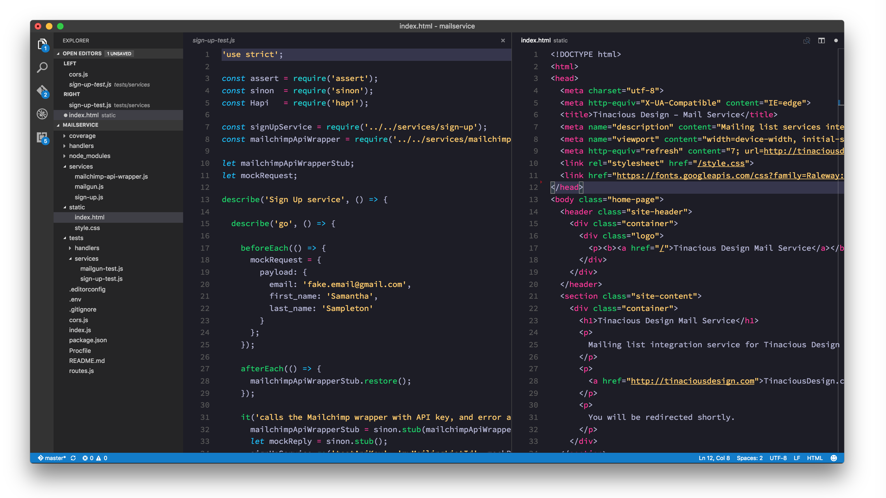
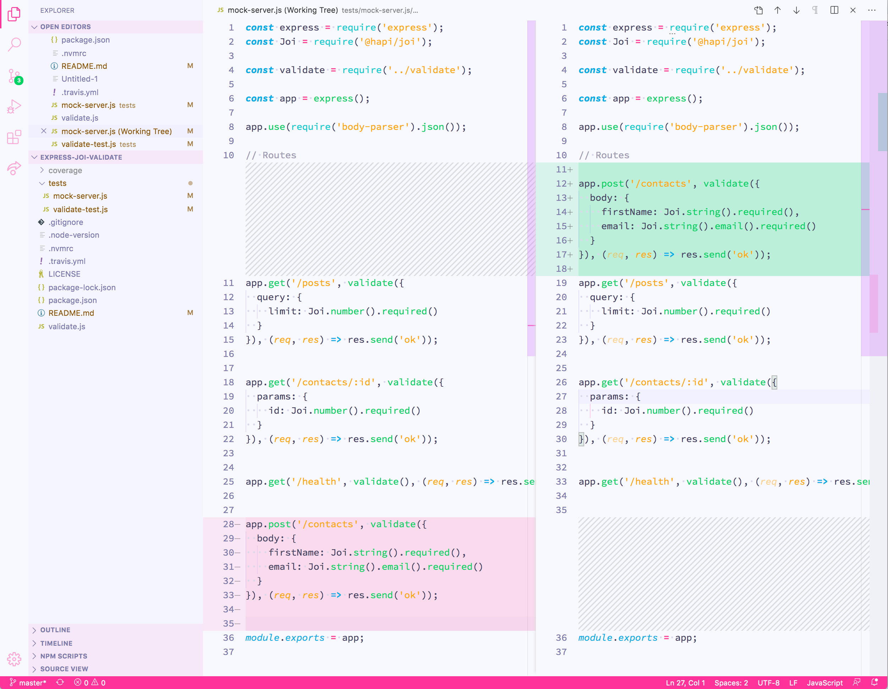

**Tinacious Design Syntax** is a syntax theme that uses a bright palette of colours including pink, blue, turquoise, green, purple, and orange.

Colours curated by Web and Mobile designer and developer Tina from [Tinacious Design](http://tinaciousdesign.com).

## Variations

This syntax theme is now available in both dark and light variations.

### Dark

## Light

## Changelog

| Date        | Version | Change                                        |
|:------------|:--------|:----------------------------------------------|
| 5 Mar 2017  | 0.2.0   | Added the Tinacious Design Light syntax theme |
| 10 Oct 2016 | 0.1.0   | Initial release                               |
