# Tinacious Design syntax

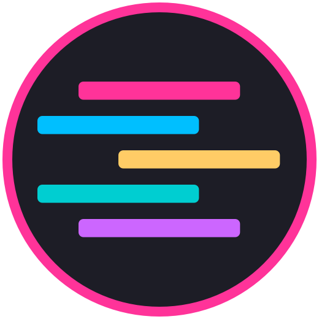

**Tinacious Design Syntax** is a syntax theme that uses a bright palette of colours including pink, blue, turquoise, green, purple, and orange.

This syntax theme is available in both dark and light variations.

Install it from the [Visual Studio Code](https://marketplace.visualstudio.com/items?itemName=tinaciousdesign.theme-tinaciousdesign) marketplace today.

**This is the original Tinacious Design Syntax colour theme.**

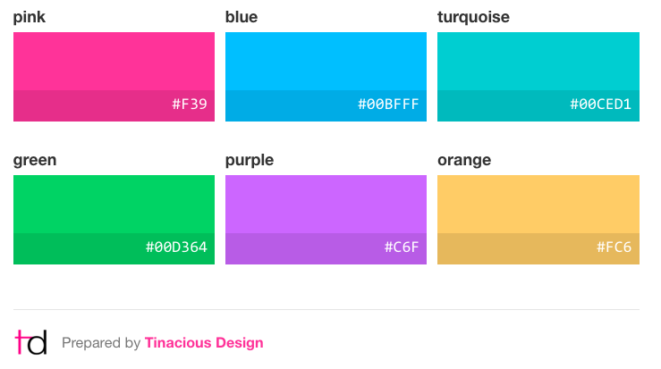

Colours curated by Web and Mobile designer and developer Tina from [Tinacious Design](http://tinaciousdesign.com). You can read more about the theme [here](https://tinaciousdesign.com/portfolio/visual-studio-code-theme/).

## Features

- Dark theme
- Light theme
- JSON support (36 levels of love 🌈)
- Markdown support
- Git diff support
- Sidebar styles
- Status bar styles

## Dark

### JSON

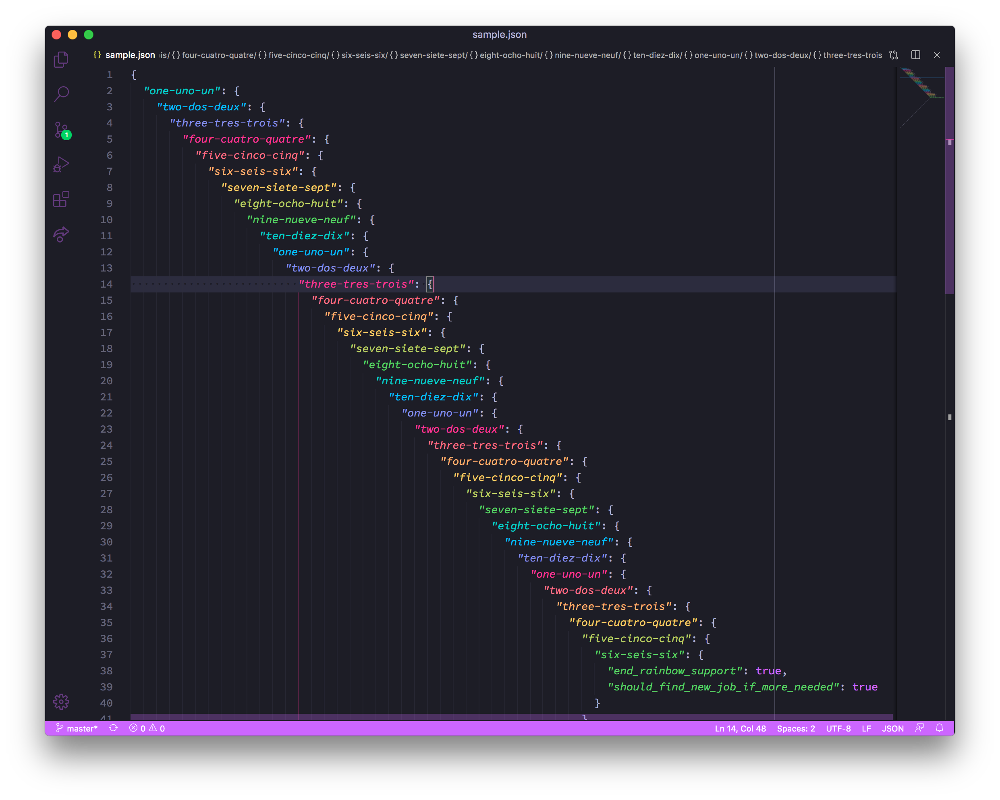

### JavaScript

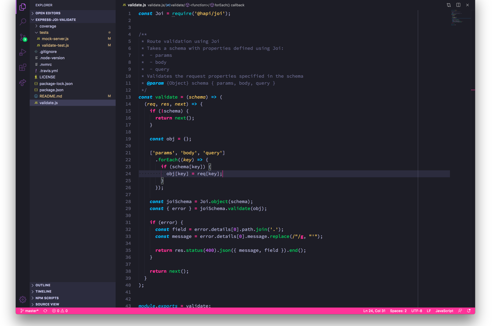

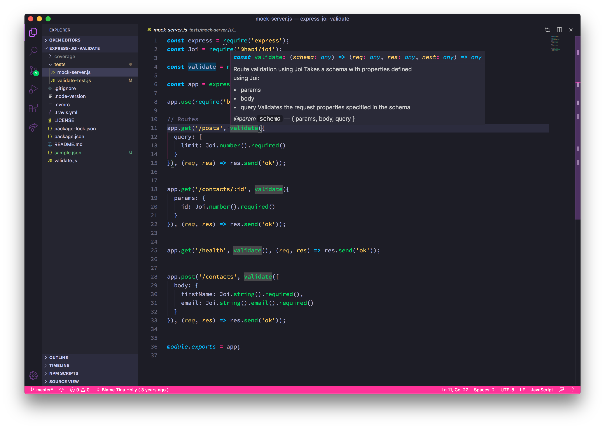

### Markdown

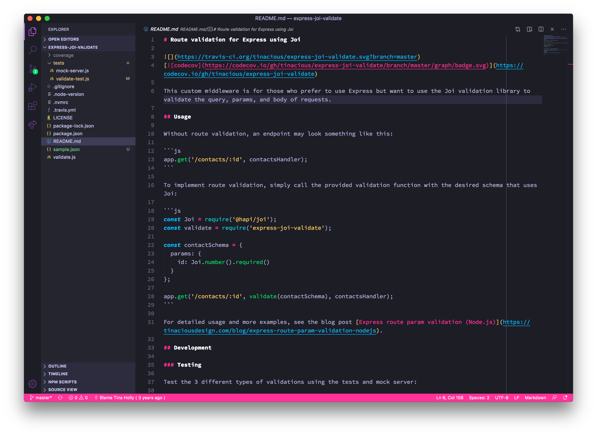

### Ruby

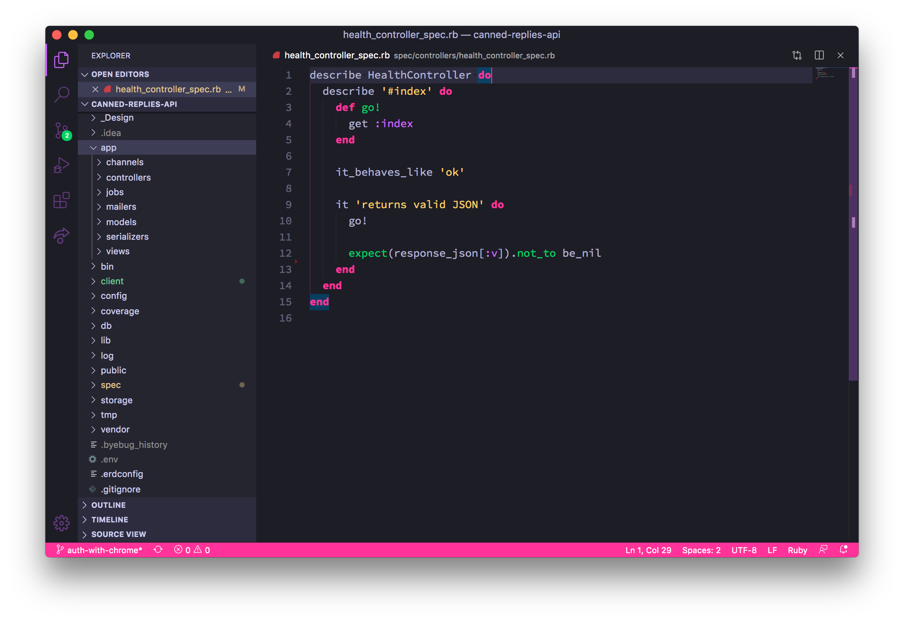

### Git

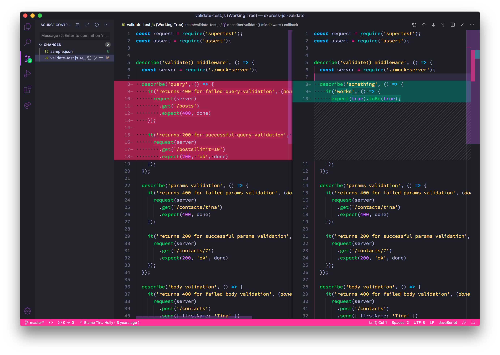

## Light

### JSON

### JavaScript

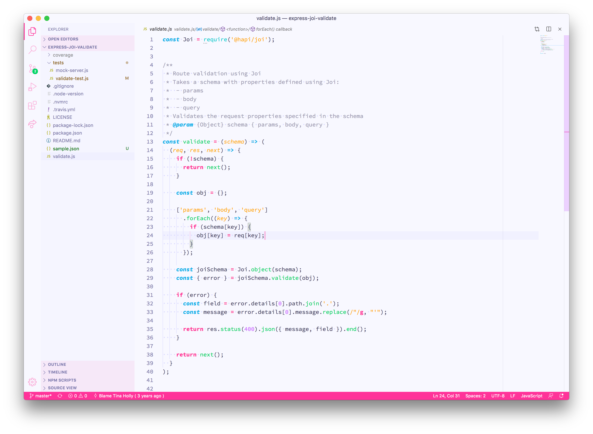

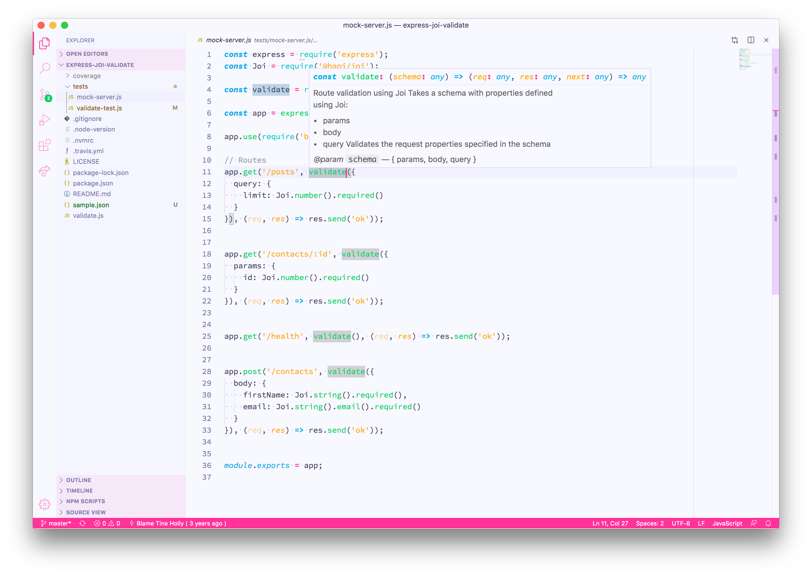

### Markdown

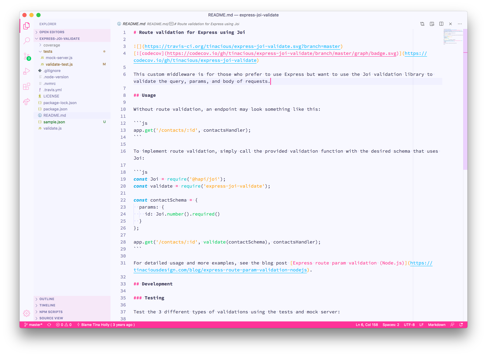

### Ruby

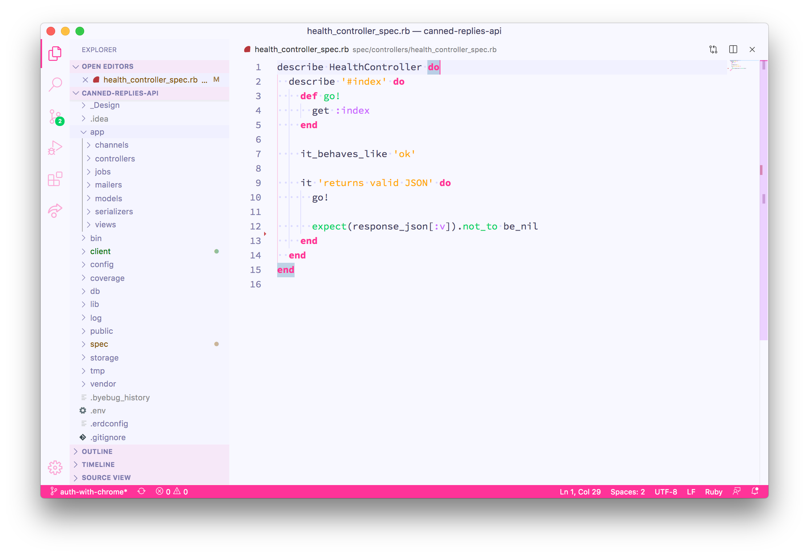

### Git

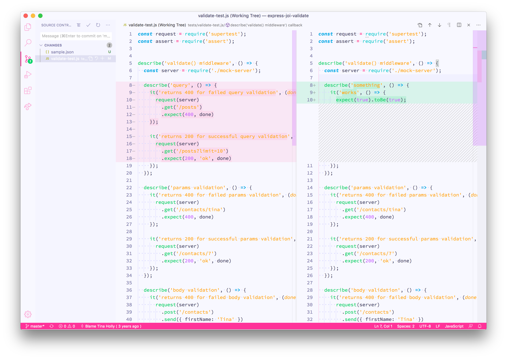

## Changelog

| Date        | Version | Change                                                                                             |
|:------------|:--------|:---------------------------------------------------------------------------------------------------|
| 26 Apr 2020 | 2.2.0   | Now with even **more** rainbow JSON! 36 levels.   🌈🌈🌈                                              |
| 26 Apr 2020 | 2.1.0   | Add support for 11 levels of nested rainbow JSON! 🌈                                                |
| 25 Apr 2020 | 2.0.0   | Add support for Markdown and Git. Sidebar and status bar design.                                   |
| 5 Mar 2017  | 0.2.0   | Added the Tinacious Design Light syntax theme. Increased contrast of current line & selected text. |
| 10 Oct 2016 | 0.1.0   | Initial release                                                                                    |
